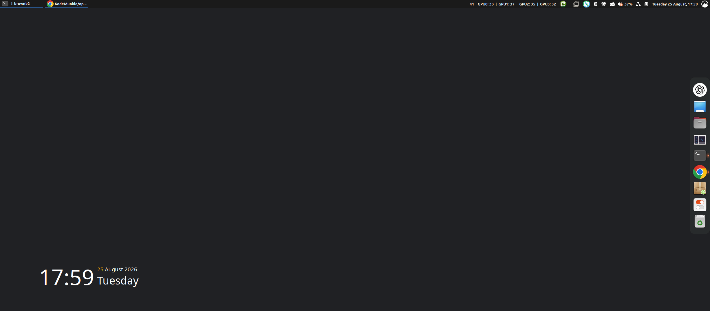
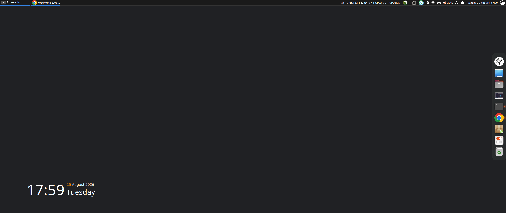

<!-- SPDX-License-Identifier: GPL-2.0-only -->
# SM750 HDMI DRM driver

Linux DRM/KMS support for the single-HDMI `SE-DP750A-HDMI` PCIe display card.
The driver provides a Cinnamon/Xorg desktop on this card while other GPUs can
remain available for compute.

> **Experimental:** this driver is for one specific SM750 board. Optional modes
> can exceed published GPU or monitor clock limits and may produce no signal,
> distortion, or an unstable display. Keep SSH or another recovery route
> available when trying non-EDID modes.

## Is my card supported?

The tested board is sold or marked as `SE-DP750A-HDMI` and has all of these:

- Silicon Motion `SM750G10-AC`, revision A1
- PCI ID `126f:0750`
- Silicon Image/Lattice `SiI9024ACNU` HDMI transmitter
- 16 MiB display memory
- One HDMI output

The PCI ID alone is not enough. Other SM750 cards may use VGA, a different
transmitter, or different GPIO wiring and are not currently supported.

## Install

Ubuntu 24.04 and Linux Mint 22 users can build a DKMS package locally:

```sh
sudo apt update
sudo apt install build-essential dkms linux-headers-$(uname -r) libdrm-dev git
git clone https://github.com/KodeMunkie/sm750hdmifb.git
cd sm750hdmifb
make check
./build-package.sh
sudo apt install ./dist/sm750hdmifb_0.5.5_all.deb
sudo reboot
```

The reboot matters: it lets the package blacklist Linux's old `sm750fb` driver
before it can claim the card. The package is named `sm750hdmifb`; the kernel
module is `sm750hdmidrm.ko` so it cannot be confused with `sm750fb.ko`.

After reboot, check the active driver:

```sh
lspci -nnk -d 126f:0750
cat /sys/module/sm750hdmidrm/parameters/scanout_format
```

Prebuilt packages, when available, are published under
[GitHub Releases](https://github.com/KodeMunkie/sm750hdmifb/releases).
Building locally is recommended because DKMS compiles against the installed
kernel headers.

## Normal use

By default the driver:

- Uses monitor EDID modes
- Uses dithered 16-bit RGB565 scanout
- Uses a hardware cursor
- Coalesces updates on a worker
- Uploads eight-row batches with DMA
- Falls back safely if DMA fails

Applications still render in 32-bit colour. Immediately before upload, the
driver converts changed screen regions to RGB565 and applies Benjamin Brown's
ordered dither with a 94% green-channel correction. This is the default because the
SM750 framebuffer is reached over a PCIe 1.1 x1 link. At the higher resolutions
that link cannot provide responsive full-screen 32-bit updates: XRGB8888 sends
four bytes per output pixel, while RGB565 sends two. Dithered RGB565 therefore
halves device-bound pixel traffic while preserving much of the apparent colour
detail.

Common kernel or GRUB options are:

| Option | Effect |
|---|---|
| `sm750hdmidrm.scanout_format=xrgb8888` | Full 32-bit scanout; uses more bus bandwidth |
| `sm750hdmidrm.scanout_format=rgb565` | Plain 16-bit scanout without dithering |
| `sm750hdmidrm.scanout_format=rgb565-bbdither` | Recommended dithered 16-bit scanout |
| `sm750hdmidrm.enable_dma=0` | Use CPU uploads instead of DMA |
| `sm750hdmidrm.disable_hardware_cursor=1` | Use the software cursor fallback |
| `sm750hdmidrm.edid_only=0` | Expose the tested driver mode catalogue |
| `sm750hdmidrm.softscale_wide=1` | Add 2464x1080 and 2560x1080 logical modes |
| `sm750hdmidrm.sharpen=1` | Add subtle sharpening after wide scaling |
| `sm750hdmidrm.double_shadow=1` | Trim updates to pixels that actually changed |

Add options to the existing `GRUB_CMDLINE_LINUX_DEFAULT` value in
`/etc/default/grub`, then apply them with:

```sh
sudo update-grub
sudo reboot
```

Every option and its default is listed in
[Module parameters](docs/PARAMETERS.md).

## Ultrawide scaling

The device is normally described as supporting up to 1920 pixels horizontally.
This driver also exposes the following tested modes when `edid_only=0`:

| Desktop mode | Refresh rates | HDMI scanout |
|---|---|---|
| `2048x864` | 59.94, 60, 70, 72, 75 Hz | Native 2048x864 |
| `2048x1024` | 59.94, 60, 70, 72 Hz | Native 2048x1024 |
| `2048x1080` | 50, 59.94, 60, 70, 72, 75 Hz | Native 2048x1080 |
| `2048x1152` | 59.94, 60 Hz | Native 2048x1152 |
| `2464x1080` | 50, 59.94, 60, 70, 72, 75 Hz | Scaled to 2048x1080 |
| `2560x1080` | 50, 59.94, 60, 70, 72, 75 Hz | Scaled to 2048x1080 |

**2048 pixels is the highest real width this card can produce in hardware.**
The SM750 primary graphics plane has an 11-bit right-edge field, so its physical
scanout width cannot exceed 2048 pixels. This is a hardware constraint;
reducing the height does not release more horizontal bits. The 2464 and 2560
modes create wider workspaces in software, but the card still outputs only a
2048-pixel-wide signal.

An ultrawide monitor with a stretch or full-width scaling mode is required for
the intended result. The complete path is:

```text
logical desktop -> driver compression -> 2048x1080 HDMI -> monitor expansion
```

For `2560x1080`, the driver performs an optimized 5:4 reduction from 2560 to
2048 pixels, a 20% horizontal compression. A 2560-wide monitor then expands the
2048-pixel signal by 25% back across its panel. This provides a true
2560x1080-sized workspace, but some fine horizontal detail is necessarily
combined during the first step.

`2464x1080` is the higher-performance, often sharper compromise. It starts with
3.75% fewer desktop pixels and compresses width by only 16.9% before sending the
same 2048x1080 signal. The monitor still expands that signal across 2560 panel
pixels, so less source detail was discarded by the driver, but the final image
is about 3.9% wider than its logical geometry. This slight aspect distortion is
the tradeoff for improved responsiveness and perceived sharpness.

Both wide modes can apply a small fixed 8% contrast sharpen after compression.
It restores some edge definition lost to filtering; it does not recreate
discarded pixels. The dither and green correction are applied during the final
RGB565 conversion before the 2048-wide scanout is uploaded.

This tested profile enables the driver mode catalogue and wide scaling:

```text
sm750hdmidrm.edid_only=0 sm750hdmidrm.softscale_wide=1 sm750hdmidrm.sharpen=1 sm750hdmidrm.scanout_format=rgb565-bbdither sm750hdmidrm.double_shadow=1 sm750hdmidrm.enable_dma=1
```

Some catalogue refresh rates run the SM750 DVO path or the monitor outside
published limits. A mode being listed does not guarantee that every monitor,
cable, KVM, or adapter will accept it. See
[Modes and clock risks](docs/MODES.md) before experimenting.

## Custom desktop dither

`rgb565-bbdither` uses an 8x8 ordered dither conceived and tuned by Benjamin
Brown specifically for desktop use on this card. It includes an adjustable
green-channel correction and anchors the pattern to screen coordinates, so
small updates do not make the pattern crawl or leave mismatched patches.

This is not a copied generic colour filter. Benjamin developed the dither's
behaviour and performed the physical tuning; its implementation and automated
tests were completed with AI assistance.

## Screenshots



*2464x1080 desktop scaled to a 2048x1080 HDMI signal.*



*2560x1080 desktop using the optimized 5:4 scaler.*

## Troubleshooting

Check binding and recent driver messages:

```sh
lspci -nnk -d 126f:0750
journalctl -k -b | grep -iE 'sm750|sii902'
```

If an experimental mode gives no signal, boot an older kernel entry or remove
the added `sm750hdmidrm.*` GRUB options from recovery access. Testing and live
reload guidance is in [Testing and recovery](docs/TESTING.md).

## Developers

- [Hardware and capability comparison](docs/HARDWARE.md)
- [Module parameters](docs/PARAMETERS.md)
- [Modes and clock risks](docs/MODES.md)
- [Provenance and licensing audit](docs/PROVENANCE.md)
- [Testing and recovery](docs/TESTING.md)
- [Manual CI build](https://github.com/KodeMunkie/sm750hdmifb/actions/workflows/build.yml)

The official SM750 specification is known to be wrong for at least one
hardware-observed partial-update boundary. Empirically verified workarounds are
documented in the source and must not be removed solely because an ideal model
or specification says they are unnecessary.

## Licence and disclosure

The project is **GPL-2.0-only**. DDK-derived files came from Linux's GPL-2.0
staging `sm750fb` driver. No proprietary Silicon Motion driver, binary object,
firmware blob, or closed library is included or linked. See the
[provenance audit](docs/PROVENANCE.md) for details.

This project was created through extensive AI-assisted or "vibe coding" under
Benjamin Brown's direction. Benjamin specified and physically tested the
behaviour and designed the custom dither, but does not claim enough Linux DRM,
KMS, DKMS, or kernel-framework expertise to independently guarantee every
implementation detail. The source is published for review and improvement,
not as a claim of upstream kernel quality. Expert review is welcome.

The software is provided without warranty. See [LICENSE](LICENSE).
